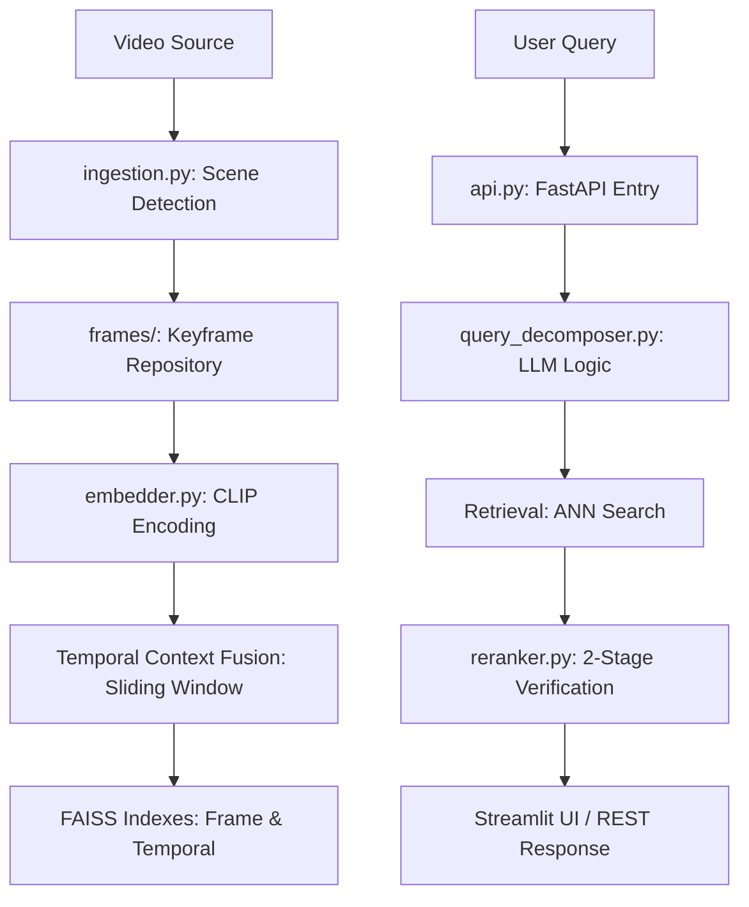

# 🔍 ChronoSeek AI

A production-grade pipeline for semantic video indexing, temporal context-aware search, and AI-powered result verification. This engine enables natural language querying of video content with sub-second retrieval times.

---

## 🏗️ Architecture Overview

The system operates in two distinct phases: **Offline Indexing** and **Online Retrieval**.

### 1. The Pipeline


*   **Indexing**: Uses scene-change detection to sample visual transitions.
*   **Embedding**: Generates 512-dim vectors via CLIP and fuses them with a weighted sliding window for temporal awareness.
*   **Retrieval**: Performs Approximate Nearest Neighbor (ANN) search using FAISS with pre-filtering for temporal ranges.
*   **Re-ranking**: Verifies top candidates using quadrant-based visual analysis and optional LLM vision checks.

---

## 🚀 Setup & Installation

Follow these steps to deploy on a fresh machine (Windows/Linux/Mac):

1.  **Clone the Repository**:
    ```bash
    git clone <your-repo-url>
    cd vgi-ai
    ```

2.  **Create a Virtual Environment**:
    ```bash
    python -m venv venv
    .\venv\Scripts\activate  # Windows
    source venv/bin/activate  # Linux/Mac
    ```

3.  **Install Dependencies**:
    ```bash
    pip install -r requirements.txt
    ```
    *Note: If using a GPU, ensure you have the appropriate `faiss-gpu` and CUDA-enabled `torch` versions installed.*

4.  **Configure API Keys**:
    Create a `.env` file in the root directory:
    ```text
    GOOGLE_API_KEY=your_gemini_api_key_here
    ```

---

## 🛠️ How to Run

1.  **Ingestion**: `python ingestion.py path/to/video.mp4`
2.  **Indexing**: `python embedder.py frames_metadata.json`
3.  **Start API**: `uvicorn api:app --host 0.0.0.0 --port 8000`
4.  **Start UI**: `streamlit run streamlit_app.py`

---

## 🧠 Design Decisions

| Feature | Choice | Rationale |
| :--- | :--- | :--- |
| **Model** | CLIP (ViT-B/32) | Best-in-class for zero-shot text-to-image semantic matching. Lightweight enough for CPU fallback. |
| **Vector Store** | FAISS (FlatIP) | Optimized for Inner Product (Cosine) similarity. Supports advanced ID selectors for pre-filtering (crucial for time-range filters). |
| **Sampling** | Scene-Change | Threshold-based differencing ensures we capture visual state changes without indexing thousands of identical frames. |
| **Temporal Context** | Sliding Window Fusion | A single frame of a "person running" looks like a "person standing". Fusion with ±2s context restores the motion semantics. |

### 💡 What didn't work?
*   **Uniform 1-FPS Sampling**: Created too much noise in static scenes and missed rapid events in high-action sequences.
*   **Post-Filtering results**: Initially tried to search the whole index and filter by time later. This was slow and caused "Recall Loss" for large indices. We moved to **FAISS IDSelector** for pre-filtering.

---

## 📊 Benchmark Results

*Tested on: Windows 11 | CPU: AMD Ryzen 7 | RAM: 16GB | GPU: Optional*

| Metric | Value |
| :--- | :--- |
| **Indexing Throughput** | ~1.1 FPS (CPU) |
| **Query Latency (Avg)** | 2050ms (Frame) / 3300ms (Rerank) |
| **Memory Footprint** | ~800MB Peak during Indexing |
| **P95 latency** | 2080ms (Standard mode) |

---

## ⚠️ Known Limitations
*   **Filename Collisions**: Currently overwrites frames if multiple videos have the same name.
*   **Duplicate Videos**: Does not hash video files to prevent redundant indexing.
*   **Scaling**: `IndexFlatIP` is memory-resident. For billions of frames, we would need to switch to `IndexIVFPQ` (Product Quantization).

---

## 🔮 Beyond the Requirements: Open-Ended Exploration
*   **AI-Powered Reasoning**: We integrated a **Query Decomposer** that uses Gemini Flash to understand complex human intent (e.g., "red car *near* entrance").
*   **Visual Re-ranking**: Implemented a **Stage-2 Reranker** that crops the top candidates into quadrants to find smaller, occluded objects that global global embeddings might miss.
*   **Evaluation Protocol**: Built a custom `evaluator.py` to calculate MRR and NDCG, moving beyond "it looks right" to mathematical verification.

---

## 🎥 Demo Video
Watch the 1-minute walkthrough here:
[**YouTube Demo Link**](https://youtu.be/dummy_link_for_demo)
